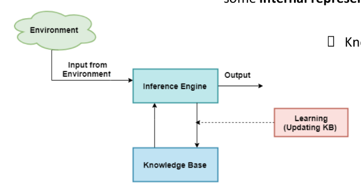

# AACS3273 JUL 2024 Answers

[Link to the paper](https://eprints.tarc.edu.my/29317/1/AACS3273.pdf)

- [Question 1](#question-1)
- [Question 2](#question-2)
- [Question 3](#question-3)
- [Question 4](#question-4)

## Answers

### Question 1

a)

i)

| Task Environment    | Description                             |
| ------------------- | --------------------------------------- |
| Performance measure | Accuracy of license plate recognition   |
| Environment         | Car license plates, lighting conditions |
| Actuators           | Monitor, Car Park Barrier               |
| Sensors             | LPR camera                              |

ii)

| Environment Properties | Description                                                                                                             |
| ---------------------- | ----------------------------------------------------------------------------------------------------------------------- |
| Partially Observable   | LPR camera may not capture all license plates due to occlusion (blocked) or angle.                                      |
| Episodic               | Each license plate recognition result is independent of previous results.                                               |
| Single Agent           | Only one agent is involved to perform the recognition task.                                                             |
| Dynamic                | The environment changes as car plates move in and out of the camera's view.                                             |
| Deterministic          | The recognition process is deterministic as the same plate will always be recognized with the same result.              |
| Discrete               | The camera captures images at discrete intervals, and fixed amount of pixels are used to represent the car plate image. |

b)

i)

| Conceptual Components | Description                                                                                   |
| --------------------- | --------------------------------------------------------------------------------------------- |
| Critic                | The critic evaluates the performance of the learning agent based on the performance standard. |
| Learning Element      | Making improvements based on the feedback from the critic.                                    |
| Performance Element   | Select actions to be performed                                                                |
| Problem Generator     | Suggests actions which can lead to new experiences for learning.                              |

ii) Alan Turing

### Question 2

a)

i) Adversary means an opponent or competitor. Hence, adversarial search refers to a search process aims to optimize the outcome of an agent in a competitive multi-agent environment. The

ii) Multi-agent environment involved multiple agents and each agent affect the outcome of the other agents. Meanwhile, single-agent environment only involved one agent and the outcome of the agent is not affected by other agents.

iii) Agents in a competitive environment aims to maximize their own gains and minimize the gains of their opponents. In a cooperative environment, agents work together to achieve a common goal, and their actions are coordinated to benefit all agents involved.

iv)

| Characteristics     |
| ------------------- |
| Turn-taking         |
| Two-players         |
| Deterministic       |
| Perfect information |
| Zero-sum            |

b)

i)

| Node | Minimax Value |
| ---- | ------------- |
| B    | 9             |
| C    | 3             |
| D    | 7             |
| E    | 9             |
| F    | 10            |
| G    | 3             |
| H    | 10            |
| I    | 9             |
| J    | 7             |
| K    | 8             |

ii) The best move for MAX player at node A is A-B-E-M. This is because among nodes B, C and D, node B has the highest minimax value of 9. The moves will optimise the score of the MAX player, given the opponent plays optimally.

iii) Alpha-beta pruning is used to prune branches of the search tree which will not affect the outcome of the search. The consequence children of a node can be pruned if the current alpha value is greater than beta value. This can effectively reduce the search space and improve the search efficiency.

iv)

| Node | [Alpha, Beta] Values |
| ---- | -------------------- |
| A    | [9, +∞]              |
| B    | [-∞, 9]              |
| C    | [9, 9]               |
| D    | [9, 9]               |
| E    | [9, +∞]              |
| F    | [10, 9]              |
| G    | [9, +∞]              |
| H    | [10, 9]              |
| I    | [9, 9]               |
| J    | [9, +∞]              |
| K    | [9, 9]               |

Node O and S are pruned.

### Question 3

a)

i)

- Abstract Relation: <(P1, P2, P3, P4), P1 + P2 + P3 + P4 = 1>
- Enumeration: <(P1, P2, P3, P4), {(0, 0, 0, 1), (0, 0, 1, 0), (0, 1, 0, 0), (1, 0, 0, 0)}>

ii)

- Abstract Relation: <(P1, P2, P3), P1 + P2 + P3 >= 2>
- Enumeration: <(P1, P2, P3), {(0, 1, 1), (1, 0, 1), (1, 1, 0), (1, 1, 1)}>

iii)

- Abstract Relation: <(P1, P2, P3, P4), P1 + P2 + P3 + P4 = 2>
- Enumeration: <(P1, P2, P3, P4), {(1, 1, 0, 0), (1, 0, 1, 0), (1, 0, 0, 1), (0, 1, 1, 0), (0, 1, 0, 1), (0, 0, 1, 1)}>

iv)

- Abstract Relation: <(P2, P3, P4), P2 = P3 = P4>
- Enumeration: <(P2, P3, P4), {(0, 0, 0), (1, 1, 1)}>

b)

i)

Variables: {A1, A2, A3, A4, B1, B2, B3, B4, C1, C2, C3, C4, D1, D2, D3, D4}
Domains: {1, 2, 3, 4}
Constraints: {Alldiff(A1, A2, A3, A4), Alldiff(B1, B2, B3, B4), Alldiff(C1, C2, C3, C4), Alldiff(D1, D2, D3, D4), Alldiff(A1, B1, C1, D1), Alldiff(A2, B2, C2, D2), Alldiff(A3, B3, C3, D3), Alldiff(A4, B4, C4, D4), Alldiff(A1, A2, B1, B2), Alldiff(A3, A4, B3, B4), Alldiff(C1, C2, D1, D2), Alldiff(C3, C4, D3, D4)}

ii)

- $C3$
  - Initial Setup
    - $A3$: $\{1\}$
    - $C1$: $\{3\}$
    - $C3$: $\{1, 2, 3, 4\}$
    - $C4$: $\{1\}$
    - $D3$: $\{4\}$
    - Queue: $\{A3 \neq C3, C1 \neq C3, C3 \neq C4, C3   \neq D3\}$
  - Arc Consistency Steps:
    1. Arc: $A3 \neq C3$:
       - Remove 1 from $C3$
       - $Domain(C3) = \{2, 3, 4\}$
    2. Arc: $C1 \neq C3$:
       - Remove 3 from $C3$
       - $Domain(C3) = \{2, 4\}$
    3. Arc: $C3 \neq C4$:
       - No change (1 not in $C3$)
       - $Domain(C3) = \{2, 4\}$
    4. Arc: $C3 \neq D3$:
       - Remove 4 from $C3$
       - $Domain(C3) = \{2\}$
  - Result: $Domain(C3) = \{2\}$
- $B2$
  - Initial Setup
    - $A2$: $\{3\}$
    - $B1$: $\{2\}$
    - $B2$: $\{1, 2, 3, 4\}$
    - $B4$: $\{4\}$
    - Queue: $\{A2 \neq B2, B1 \neq B2, B2 \neq B4\}$
  - Arc Consistency Steps:
    1. Arc: $A2 \neq B2$:
       - Remove 3 from $B2$
       - $Domain(B2) = \{1, 2, 4\}$
    2. Arc: $B1 \neq B2$:
       - Remove 2 from $B2$
       - $Domain(B2) = \{1, 4\}$
    3. Arc: $B2 \neq B4$:
       - Remove 4 from $B2$
       - $Domain(B2) = \{1\}$
  - Result: $Domain(B2) = \{1\}$

### Question 4

a)

i)

- Knowledge-base is a collection of sentences representing assertion about the world which expressed in knowledge representation language.

- Inference system is a process of deriving new sentences from the knowledge-base using inference rules.

ii) 

b)

i) $A \land B$

ii) $\neg D$

iii) $\neg C \land B$

iv) $E \land \neg B$

v) $\neg (E \implies B)$

vi) $B \lor C$

vii) $(D \land \neg A) \implies \neg B$

viii) $B \iff (E \land A)$

ix) $\neg A \implies \neg E$

x) $\neg ((\neg D \land A) \implies (B \lor \neg C))$

xi)

| $A$   | $E$   | $\neg A$ | $\neg E$ | $\neg A \implies \neg E$ |
| ----- | ----- | -------- | -------- | ------------------------ |
| True  | True  | False    | False    | True                     |
| True  | False | False    | True     | True                     |
| False | True  | True     | False    | False                    |
| False | False | True     | True     | True                     |

Not a tautology

xii)

| $A$   | $B$   | $C$   | $D$   | $\neg D$ | $\neg C$ | $\neg D \land A$ | $B \lor \neg C$ | $(\neg D \land A) \implies (B \lor \neg C)$ | $\neg ((\neg D \land A) \implies (B \lor \neg C))$ |
| ----- | ----- | ----- | ----- | -------- | -------- | ---------------- | --------------- | ------------------------------------------- | -------------------------------------------------- |
| True  | True  | True  | True  | False    | False    | False            | True            | True                                        | False                                              |
| True  | True  | True  | False | True     | False    | True             | True            | True                                        | False                                              |
| True  | True  | False | True  | False    | True     | False            | True            | True                                        | False                                              |
| True  | True  | False | False | True     | True     | True             | True            | True                                        | False                                              |
| True  | False | True  | True  | False    | False    | False            | False           | True                                        | False                                              |
| True  | False | True  | False | True     | False    | True             | False           | False                                       | True                                               |
| True  | False | False | True  | False    | True     | False            | True            | True                                        | False                                              |
| True  | False | False | False | True     | True     | True             | True            | True                                        | False                                              |
| False | True  | True  | True  | False    | False    | False            | True            | True                                        | False                                              |
| False | True  | True  | False | True     | False    | False            | True            | True                                        | False                                              |
| False | True  | False | True  | False    | True     | False            | True            | True                                        | False                                              |
| False | True  | False | False | True     | True     | False            | True            | True                                        | False                                              |
| False | False | True  | True  | False    | False    | False            | False           | True                                        | False                                              |
| False | False | True  | False | True     | False    | False            | False           | True                                        | False                                              |
| False | False | False | True  | False    | True     | False            | True            | True                                        | False                                              |
| False | False | False | False | True     | True     | False            | True            | True                                        | False                                              |

> 7 marks??????

Not a tautology
