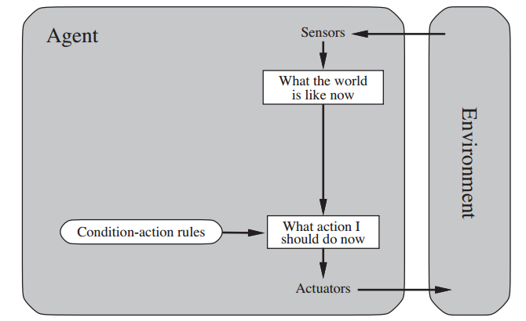
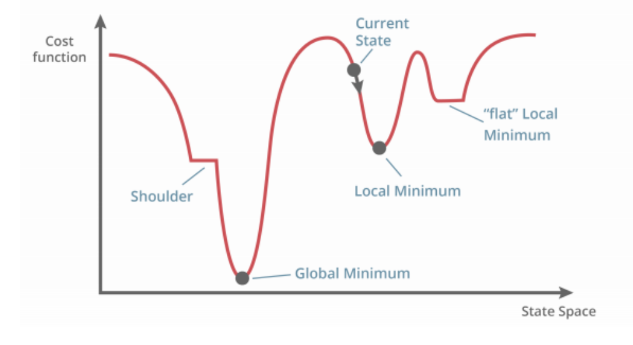
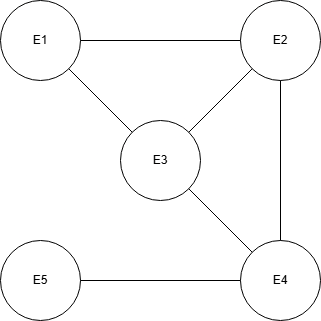

# AACS3273 MAY 2024 Answers

[Link to the paper](https://eprints.tarc.edu.my/28548/1/AACS3273.pdf)

- [Question 1](#question-1)
- [Question 2](#question-2)
- [Question 3](#question-3)
- [Question 4](#question-4)

## Answers

### Question 1

a) Agent is anything that can be viewed as perceiving its environment through sensors and acting upon that environment through actuators.

b)

- Performance Measure
- Prior Knowledge of the Environment
- Actions that can be performed
- Percept sequence to date
- For each possible **percept sequence**, a rational agent should **select an action** that is expected to **maximize the performance measure**, given the evidence provided by the percept sequence and whatever **built-in knowledge** the agent has.

c) 

> Percept -> Understand what the world is like currently -> Select action based on condition-action rules -> Action

d)

- Agents need to model and keep track of complicated environments.
- Developing utility-functions requires use of effective and efficient algorithms.
- Solution with high computational complexity may not be practical.

e) Simple reflex agent is more suitable for autonomous driving cars. Simple reflex agent can be used to detect the road condition and determine the action according to the condition-action rules. In contrast, table-driven agent is not suitable for autonomous driving cars because the possible percept sequences are too large to be stored in a table, requires large amount of memory and excessive time to search the table, not suitable for real-time applications.

f) Utility-based agent is more suitable for autonomous driving cars. Utility-based agent can evaluate the performance of each action and select the action that maximizes the utility function. The car can make a more safe and cost-effective decision to real the destination. In contrast, goal-based agent is not suitable for autonomous driving cars because it only focuses on reaching the destination without considering the cost and safety of the actions. The car may take a longer route or make unsafe decisions to reach the destination.

### Question 2

a)

i) Yes, this is because the problem aims to find a solution that is the most optimal and efficient among all solutions, which is to minimize the wasted material from the cutting process.

ii)

| Local Search Strategy                                         | Classical Search Strategy                            |
| ------------------------------------------------------------- | ---------------------------------------------------- |
| Does not systematically explore the search space              | Systematically explores the search space             |
| Does not keep track of unexpanded nodes and/or expanded nodes | Keep track of unexpanded nodes and/or expanded nodes |

iii) 

> 5 states:
>
> - Current State
> - Local Minimum
> - Global Minimum
> - Shoulder
> - Flat Local Minimum

b)

i) 12

> each queen can move to the other 3 squares on the same column. There are 4 queens on the same column, so 4 \* 3 = 12.

ii) 1

> The pair at A4 and B4 are conflicting

iii)

|     |     |     |     |
| --- | --- | --- | --- |
| Q   | Q   | 4   | 3   |
| 3   | 2   | 3   | Q   |
| 0   | 1   | 3   | 3   |
| 1   | 2   | Q   | 3   |

### Question 3

a)

- Let first event be E1, second event be E2, etc.

- Variable: $\{E1, E2, E3, E4, E5\}$
- Domain
  - $Dom(E1) = \{SJ, DR\}$
  - $Dom(E2) = \{AT, SJ\}$
  - $Dom(E3) = \{AT\}$
  - $Dom(E4) = \{AT, SJ, DR\}$
  - $Dom(E5) = \{SJ, DR\}$
- Constraints: $\{E1 \neq E2, E1 \neq E3, E2 \neq E3, E2 \neq E4, E3 \neq E4, E4 \neq E5\}$

b) 

c) AC-3

d)

- $Dom(E1) = \{DR\}$
- $Dom(E2) = \{SJ\}$
- $Dom(E3) = \{AT\}$
- $Dom(E4) = \{DR\}$
- $Dom(E5) = \{SJ\}$

e)

- One solution.
- $E1 = DR$, $E2 = SJ$, $E3 = AT$, $E4 = DR$, $E5 = SJ$.

f) Consistent and complete.

### Question 4

a) Model checking is a method to show a knowledge base entails a sentence, through enumerating all possible models of the knowledge base and checking if the sentence is true in all of them.

> $KB \models \alpha$
>
> Can refer to the discrete math, where we using drawing to show sentences such as P is subset of Q, through drawing the Venn diagram of P inside Q. The enumeration of all possible conclusion is what we are doing in the model checking. Then we check if the sentence is true in all of them.

b) Agree. Theorem proving is more efficient because it uses logical inference rules to derive conclusions from the knowledge base, rather than enumerating all possible models. This allows better scalability and efficiency in reasoning about complex knowledge bases.

> Theorem proving simplify the knowledge base using logical inference rules, such as De Morgan's law, Universal Bound, etc. to simplify and derive conclusions from the knowledge base.

c)

- Logical Equivalence: A sentence is logically equivalent to another if they have the same truth value in all possible models.
- Validity: A sentence is valid if it is true in all possible models, or in other words, it is a tautology.
- Satisfiability: A sentence is satisfiable if there exists at least one model in which it is true, or in other words, contigency.

d)

| $P$ | $Q$ | $\neg P$ | $\neg Q$ | $P \implies Q$ | $\neg P \land (P \implies Q)$ | [$\neg P \land (P \implies Q)] \implies \neg Q$ |
| --- | --- | -------- | -------- | -------------- | ----------------------------- | ----------------------------------------------- |
| T   | T   | F        | F        | T              | T                             | F                                               |
| T   | F   | F        | T        | F              | F                             | T                                               |
| F   | T   | T        | F        | T              | F                             | T                                               |
| F   | F   | T        | T        | T              | F                             | T                                               |

Not Tautology

| $P$ | $Q$ | $\neg P$ | $\neg Q$ | $\neg Q \land P$ | $Q \lor \neg P$ | $(\neg Q \land P) \land (Q \lor \neg P)$ | $P \lor [(\neg Q \land P) \land (Q \lor \neg P)]$ |
| --- | --- | -------- | -------- | ---------------- | --------------- | ---------------------------------------- | ------------------------------------------------- |
| T   | T   | F        | F        | F                | T               | F                                        | T                                                 |
| T   | F   | F        | T        | T                | F               | F                                        | T                                                 |
| F   | T   | T        | F        | F                | T               | F                                        | F                                                 |
| F   | F   | T        | T        | F                | T               | F                                        | F                                                 |

Not Tautology
