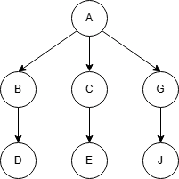
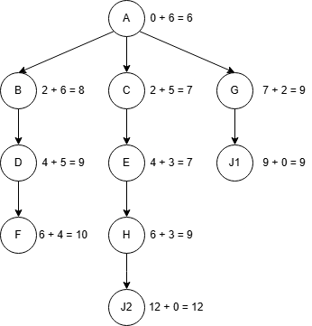
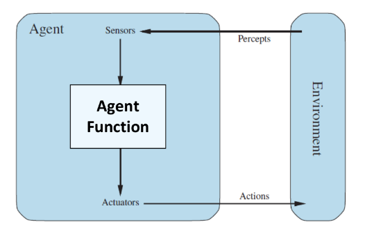
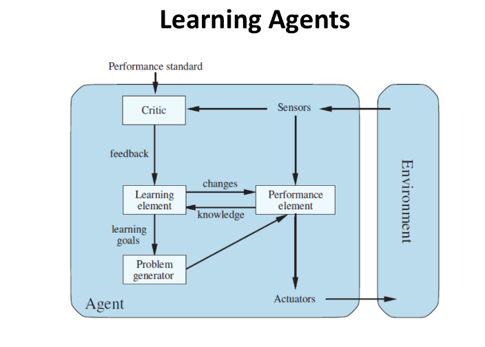

# AACS2204 OCT 2024 Answers

[Link to the paper](https://eprints.tarc.edu.my/30264/1/QP-AACS3273.pdf)

- [Question 1](#question-1)
- [Question 2](#question-2)
- [Question 3](#question-3)
- [Question 4](#question-4)

## Answers

### Question 1

a)

| Uninformed Search | Informed Search |
| ----------------- | --------------- |
| BFS, DFS          | A\*             |

b) Similarities

- Uninformed search and informed search are both able to identify goal state and non-goal state.
- Uninformed search and informed search both maintain a frontier of nodes to be explored.

c)

i)

> Assume the node are expanded in alphabetical order.

- DFS

- BFS

- A\*

ii)

| Algorithm | Sequence of nodes expanded |
| --------- | -------------------------- |
| DFS       | A, B, D, F, I, J           |
| BFS       | A, B, C, G, D, E, J        |
| A\*       | A, C, E, B, D, G, H, J1    |

iii)

| Algorithm | Solution    |
| --------- | ----------- |
| DFS       | A-B-D-F-I-J |
| BFS       | A-G-J       |
| A\*       | A-G-J1      |

iv)

| Algorithm | Cost of Solution       |
| --------- | ---------------------- |
| DFS       | 2 + 2 + 2 + 2 + 8 = 16 |
| BFS       | 7 + 2 = 9              |
| A\*       | 7 + 2 = 9              |

### Question 2

a)

i) Agent is a system that perceives its environment through sensors and performs actions through actuators according to agent function, which maps the percept sequence to an action.

ii)

- Action: Move
- State: Position

iii)

| Characteristic      | Description                                                        |
| ------------------- | ------------------------------------------------------------------ |
| Two-player          | The game consists of two players, each aims to win the opponent.   |
| Turn-taking         | For every turn, only one player can make a move.                   |
| Perfect information | Both players have complete knowledge of the game state.            |
| Deterministic       | The outcome of each action performed by the player is predictable. |
| Zero-sum            | One player's gain is the other player's loss.                      |

b)

i) Competitive multi-agent environment: Agents are competing against each other to achieve their goals, each agent's gain is the other agent's loss.

ii)

| Node | Minimax Value |
| ---- | ------------- |
| A    | 14            |
| B    | 8             |
| C    | 13            |
| D    | 14            |
| H    | 20            |
| I    | 13            |
| J    | 27            |
| K    | 14            |

iii)

The best move for MAX player is A-D-K-T, because it maximises the score of the player, given the opponent plays optimally.

iv)

| Node | [Alpha, Beta] Values |
| ---- | -------------------- |
| A    | [14, +∞]             |
| B    | [-∞, 8]              |
| C    | [8, 13]              |
| D    | [13, 14]             |
| H    | [20, +∞]             |
| I    | [13, 20]             |
| J    | [27, +∞]             |
| K    | [14, 27]             |

No node is pruned.

### Question 3

a)

| Task Environment    | Description                                        |
| ------------------- | -------------------------------------------------- |
| Performance Measure | The accuracy of recognizing the face of the person |
| Environment         | Human Face, Lighting of the reception area         |
| Actuators           | Monitor                                            |
| Sensors             | Camera                                             |

b)

| Environment Properties | Description                                                                                                                                                                                   |
| ---------------------- | --------------------------------------------------------------------------------------------------------------------------------------------------------------------------------------------- |
| Fully observable       | The environment is fully observable as the camera can capture complete facial features under adequate lighting conditions and when the person faces the camera directly as in the assumption. |
| Episodic               | The recognition of each face is independent of the previous recognition.                                                                                                                      |
| Single agent           | The system is the only agent in the environment.                                                                                                                                              |
| Dynamic                | The person may move during the recognition process, which may affect the accuracy of the recognition.                                                                                         |
| Deterministic          | The recognition process is deterministic as the same face will always be recognized as the same person.                                                                                       |
| Discrete               | The camera captures the image of the face at a specific moment in time, and the image has finite pixels.                                                                                      |

c)

> How to remember the components of a learning agent:
>
> - Critic provides feedback to the learning element, using the performance standard and percept sequence.
> - Learning element improves the performance element, performance elements provides knowledge to the learning element to take the limitations of the performance element into account.
> - Problem generator suggests actions to lead to new experiences using learning goals from the learning element.

### Question 4

a)

- Form representation of the complex world
- Derive new representation
- Decide next action based on reasoning

b)

- Proposition: A statement that can be true or false but not both.
- Logical Operator: Symbol used to combine propositions to form a compound proposition.

c)

i) $\neg C \land \neg D$

ii) $E \lor \neg E$

iii) $B \implies A$

iv) $\neg C \implies D$

v) $\neg (\neg C \implies \neg (A \lor D))$

vi) $A \lor D$

> Looks like exclusive or, but XOR is not covered in the syllabus. If it is really that tricky, it might ask for this answer: $(A \lor D) \land \neg (A \land D)$.

vii) $(\neg B \land E) \implies (\neg C \land A \land \neg D)$

viii) $A \iff (B \land C)$

ix) $\neg C \implies (\neg A \land D)$

x) $\neg ((\neg B \land \neg E) \implies (\neg C \land \neg A \land \neg D))$

d) Truth table is used to shows the truth value of a compound proposition based on the simpler propositions that make it up.

i) $\neg C \land \neg D$

| C   | D   | $\neg C$ | $\neg D$ | $\neg C \land \neg D$ |
| --- | --- | -------- | -------- | --------------------- |
| T   | T   | F        | F        | F                     |
| T   | F   | F        | T        | F                     |
| F   | T   | T        | F        | F                     |
| F   | F   | T        | T        | T                     |

Not a tautology

ii) $E \lor \neg E$

| E   | $\neg E$ | $E \lor \neg E$ |
| --- | -------- | --------------- |
| T   | F        | T               |
| F   | T        | T               |

Tautology

iii) $B \implies A$

| B   | A   | $B \implies A$ |
| --- | --- | -------------- |
| T   | T   | T              |
| T   | F   | F              |
| F   | T   | T              |
| F   | F   | T              |

Not a tautology
